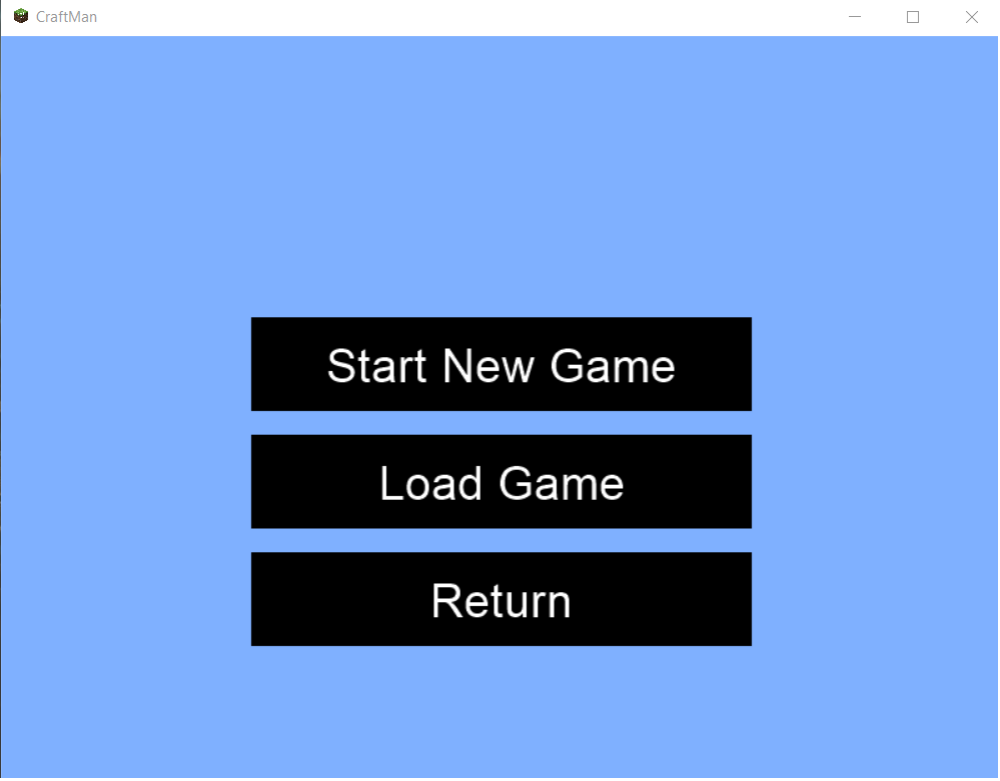
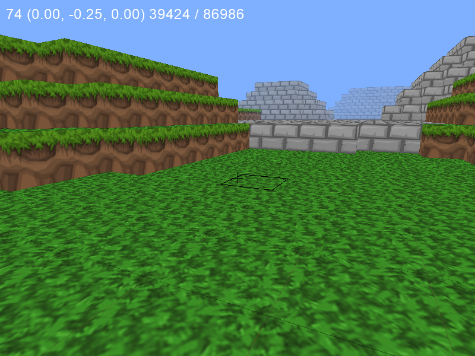
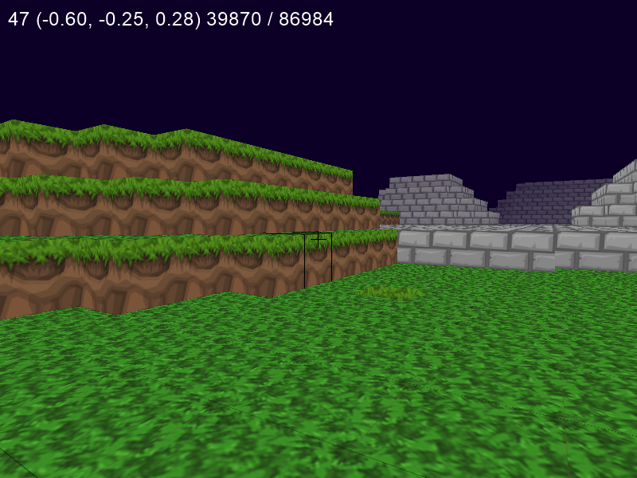
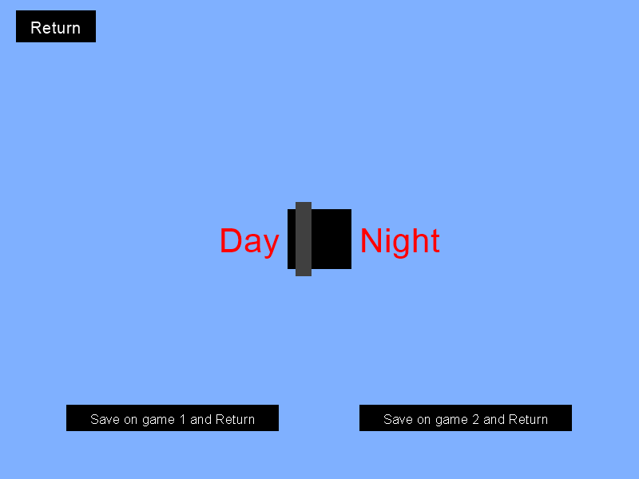
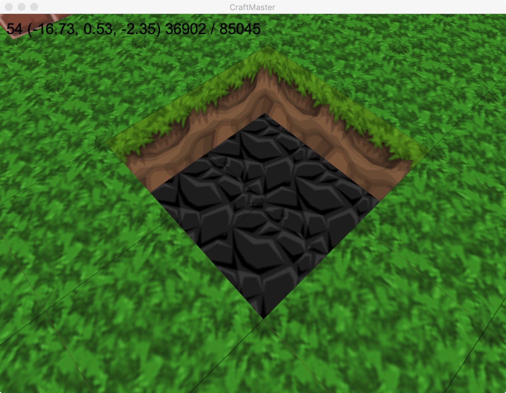

# Welcome to CraftMaster 👋
Welcome to the repository of our **Mcmaster SFWRENG 3XA3** Software Project, lead by **Prof. _Asghar Bokhari_** and supervised by **TA _Thien Trandinh_**.
The information of the group members is listed below:

| Group Member        | Role(s)                              | Contact Info           |
| ------------------- |--------------------------------------| ---------------------- |
| **Sida Wang**       | Full-Stack Developer, Game Developer | wangs132@mcmaster.ca   |
| **Weidong Yang**    | Full-Stack Developer, Game Developer | someherokris@gmail.com |
| **Deuce Cao**       | Game Developer                       | caoh8@mcmaster.ca      |

## Table of Content
- [**What is CraftMaster?**](#what)
- [**Where to start?**](#where)
- [**CraftMaster Views**](#views)
- [**Open Issues**](#open)
- [**Special Thanks**](#ac)


## <a name = "what"> What is CraftMaster❓</a>

CraftMaster is a 3D sandbox game developed by three software engineering students at Mcmaster University. It is a reimplementation of [@fogleman/Minecraft](https://github.com/fogleman/Minecraft)(refered to as orginal project) which is developed by **_Michael Fogleman_**. CraftMaster is written in [**Python**](https://www.python.org/) and [**Pyglet**](http://pyglet.org/). All the media source are open-source and found online. The executable game is generated by [**Pyintsaller**](https://www.pyinstaller.org/).
We believe that the software design principles and software architectural design patterns we applied to the project significantly increased the quality of the software. The highlights of CraftMaster are the module decomposition and novel functionalities/features of the game.
The team has also developed and deployed a game website to hold the game for downloads and updates.

<div align = "center"></div>

## <a name = "where">Where to start❓</a>
#### Download the executable game and play
- The Official Game Website can be found at [**HERE**](http://rexwangsida.pythonanywhere.com).
- To learn the instruction of how to download and play the game, follow the [**CraftMaster User Guide**](https://github.com/RexWangSida/CraftMaster/blob/master/CraftMasterGame/Docs/UserGuide/UserGuide.pdf).
### OR
#### Run the game in terminal
- This can be done in **Windows PowerShell** or **Linux/Mac Terminal**, and it requires **git**, **python** and **pyglet**, or at least **pip**.
- The instruction of how to install **python** can be found at [**HERE**](https://www.python.org/downloads/).
- The instruction of how to install **pip** can be found at [**HERE**](https://pip.pypa.io/en/stable/installing/).
- The instruction of how to install **git** can be found at [**HERE**](https://git-scm.com/book/en/v2/Getting-Started-Installing-Git).
- To install **python**(it requires pip to be installed), run:
```shell
pip install python
```
- To install **pyglet**(it requires pip to be installed), run:
```shell
pip install pyglet
```
- To start the program, sequentially run:
```shell
git clone https://github.com/RexWangSida/CraftMaster.git
```
```shell
cd CraftMaster/CraftMasterGame/src
```
```shell
python main.py
```
- To learn the instruction of how to play the game, follow the [**CraftMaster User Guide**](https://github.com/RexWangSida/CraftMaster/blob/master/CraftMasterGame/Docs/UserGuide/UserGuide.pdf).

## <a name = "views"> CraftMaster Views🏔</a>

<div align = "center"></div>
<div align = "center"></div>
<div align = "center"></div>
<div align = "center"></div>
<div align = "center"></div>
<div align = "center"></div>

## <a name = "open"> Open Issues 🚑</a>
So far the executable game is only supported on Windows OS.
- [x] Windows OS
- [ ] Mac OS

The Mac OS version is still on the way.

_[Last Edited 06/19/2020]_
## <a name = "ac"> Special Thanks 🎉</a>
We gratefully thank **_Thien Trandinh_** for the guidance throughout the term and **_Michael Fogleman_** for giving us permissions to modify the amazing original project and allow us to develop CraftMaster on the base of it.
